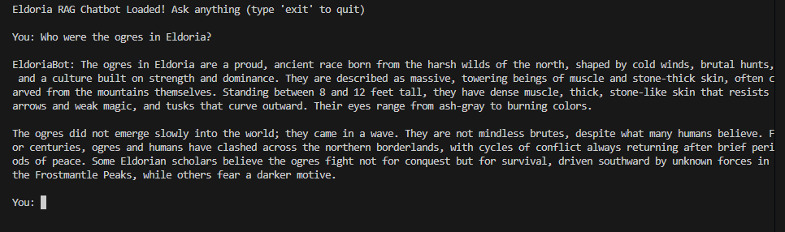
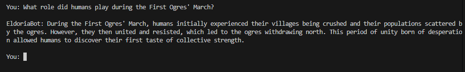

# Eldoria RAG Chatbot  
A Retrieval-Augmented Generation (RAG) chatbot built using **LangChain**, **FAISS**, and **Google Gemini**.  
It allows users to query the Eldoria lore PDF, with accurate answers grounded in the document — not hallucinated.

---

##  Features
- PDF → Text extraction  
- Text chunking  
- Embeddings generated using **Gemini Text-Embedding-004**  
- Vector storage using **FAISS**  
- Retriever for top-K relevant chunks  
- Full RAG pipeline using **gemini-2.5-flash-lite**  
- Terminal-based chatbot interface  

---

## Installation

### Clone the repository
```bash
git clone https://github.com/hiArpit/Eldoria-RAGBOT.git
cd eldoria
```
### Create and activate virtual environment
```bash
python -m venv venv
venv\Scripts\activate
```

### Install dependencies
```
pip install -r requirements.txt
```

---

## Environment Variables
Create a file named .env in the project root:
```bash
GOOGLE_API_KEY=your_api_key
```
Make sure there are no quotes around the key.

--- 

## Building the Vector Database
Run
```bash
python src/vector_store.py
```
This does:
- Loads the PDF
- Chunks the text
- Generates Gemini embeddings
- Saves the FAISS index

When complete, your data/faiss_index/ folder will be created.

--- 

## Running the RAG Chatbot
Run
```bash
python src/main.py
```
You'll see
```bash
Eldoria RAG Chatbot Loaded! Ask anything (type 'exit' to quit)
```
Example queries:
- "Who were the ogres in Eldoria?"
- "Summarize the great battle described in the text."
- "What role did humans play during the First Ogres’ March?"

---
## Demo Screenshots of working
### Here is the Eldoria RAG Chatbot answering a question:





---
## Requirements 
- pypdf
- pytesseract
- Pillow
- langchain
- langchain-core
- langchain-community
- google-generativeai
- langchain-google-genai
- faiss-cpu
- python-dotenv

---

## Future Improvements
- Add Streamlit UI 
- Improve Chunking with semantic splitting

---

## Contact
If you have any ideas for improvements, feel free to reach out to email:- **negiarpit2003@gmail.com**
